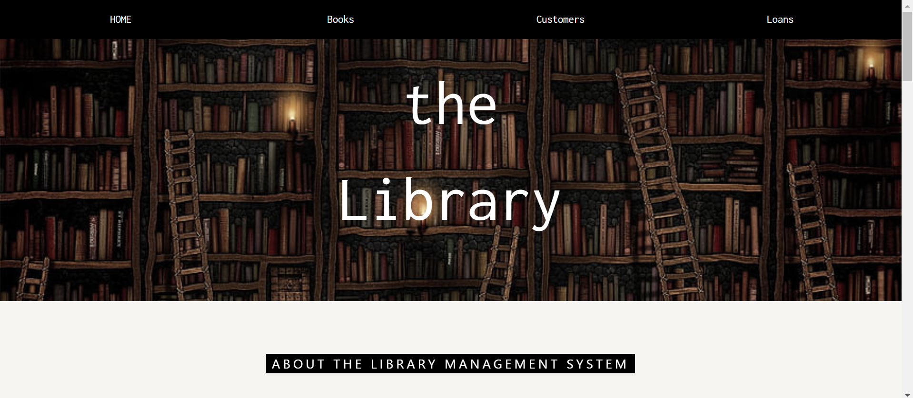
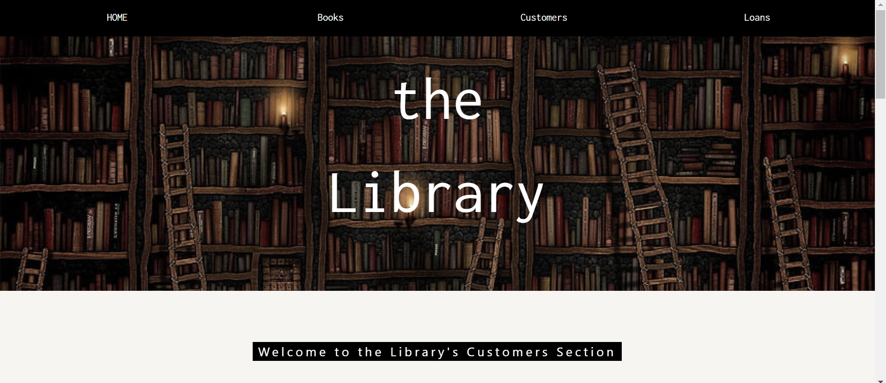

# Library Management System

A web-based Library Management System built with Flask and SQLAlchemy.

## Table of Contents

- [Introduction](#introduction)
- [Features](#features)
- [Getting Started](#getting-started)
- [Usage](#usage)
- [APIEndpoints](#API-end-point)
- [Images](#Images-from-the-website)


## Introduction

The Library Management System is a web application that allows you to manage books, customers, and loans in a library. It provides a user-friendly interface for librarians to add, modify, and delete books and customer records. It also handles the loaning and returning of books by customers.

## Features

- **Book Management:** Add, modify, and delete books. Check book availability for loaning.
- **Customer Management:** Add, modify, and delete customer records. Check customer's loan status.
- **Loan Management:** Create, update, and delete loan records. Automatically calculate the maximum return date.
- **Loan Status Check:** Check if a book is currently loaned or if a customer has any outstanding loans.
- **Expired Loans:** View a list of loans that have exceeded the return date.
- **Not Returned Loans:** View a list of loans that have not been returned by customers.
- **Returned Loans:** View a list of loans that have been successfully returned by customers.

## Getting Started

### Prerequisites

- Python (3.6+)
- Flask
- SQLAlchemy
- Flask-Migrate
- Flask-CORS

### Installation

1. Clone the repository and get everything you need:

   ```bash
   git clone https://github.com/shalevhagshur/LibProjectFinal.git
   cd ProjectLib
   python -m venv venv
   source venv/bin/activate or On Windows, use `venv\Scripts\activate`
   pip install -r Requirements.txt


2. Initialize the SQLite database and migrate:

    flask db init
    flask db migrate
    flask db upgrade

3. Start The website
    py app.py


### usage:
1. Access the application through a web browser.

2. Navigate to the Book, Customer, or Loan pages to perform various management tasks.

3. Use the API endpoints for advanced control and integration.

### API end point:
-
Books:

- GET /books: Get a list of all books or create a new book.
- GET /books/{book_id}: Get details of a specific book, update, or delete it.
- GET /books/{book_id}/loanstatus: Check the loan status of a book.
- Customers:

- GET /customers: Get a list of all customers or create a new customer.
- GET /customers/{customer_id}: Get details of a specific customer, update, or delete it.
- GET /customers/{customer_id}/loanstatus: Check the loan status of a customer.
- Loans:

- GET /loans: Get a list of all loans or create a new loan.
- GET /loans/{loan_id}: Get details of a specific loan, update, or delete it.
- PUT /loans/{loan_id}: Mark a loan as returned.
- GET /loans/expired: Get a list of expired loans.
- GET /loans/not-returned: Get a list of loans not yet returned.
- GET /loans/returned: Get a list of returned loans.

### Images from the website:







